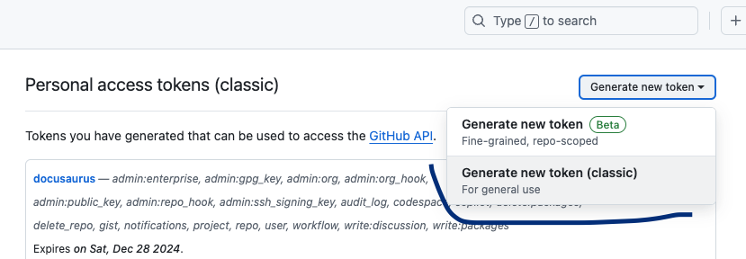

# Настройка Docusaurus для GitHub Pages

## Создание репозитория на GitHub
1. Создай **публичный** репозиторий на [GitHub](https://github.com/). 

## Настройка VS Code
1. Установи VS Code (если еще он не установлен)
2. Установи git (если еще он не установлен)
    * проверить установку можно через терминал
       ```bash
        git --version
       ```
    * Возможно потребуется настройка конфигов
      ```bash
      git config --global user.name "Your Name"
      git config --global user.email "your_email@example.com"
      ```
3. Установи менеджер пакетов npm (как аналог можно использовать yarn)
    * проверить установку можно через терминал
       ```bash
        npm --version
       ```
4. Склонируй твой репозиторий github.

##### Клонирование репозитория через HTTPS
1. Нажми кнопку Code и скопируй HTTPS-ссылку (она выглядит как `https://github.com/<username>/<repo>.git`).
2. Открой терминал в vs code и выполни команду:

```bash
git clone https://github.com/<username>/<repo>.git
```

3. Убедись, что origin настроен правильно:
```bash
git remote -v
```
В ответе должно быть:
```bash
origin  https://github.com/<username>/<repo>.git (fetch)
origin  https://github.com/<username>/<repo>.git (push)
```

## Установка Docusaurus
1. В vs code в терминале выполни команду для установки docusaurus:
```bash
npx create-docusaurus@latest my-website classic
```
2. Перейди в папку с проектом docusaurus и установи зависимости:
  ```bash
   cd my-website
   npm install
  ```

## Настройка docusaurus.config.js
> Это основной файл конфигурации docusaurus.
> Подробнее о настройке docusaurus.config.js можно прочитать [здесь](https://docusaurus.io/docs/configuration).

1. Открой файл docusaurus.config.js и внеси следующие изменения:
* `url: 'https://<username>.github.io' ` -  имя пользователя на github.
* `baseUrl: <repository-name>` - имя репозитория.
* `organizationName: <username>` - ваше имя пользователя
* `projectName: <repository-name>` - имя репозитория
* `onBrokenLinks: 'warn'`
* `onBrokenMarkdownLinks: 'warn'` 
* `trailingSlash: false`
* `deploymentBranch: 'gh-pages'` - ветка, на которой будет развернут сайт,  это ветка по умолчанию для GitHub Pages.
* `blog: false` - можешь отключить блог

## Локальный запуск
1. Запусти локально docusaurus командой:
  ```bash
  npm run start
  ```
2. Если сборка успешна - в браузере откроется `http://localhost:3000/<baseUrl>`

## Установка плагинов для работы с документацией
1. Открой package.json и в dependencies укажи плагины:
```json
  "redocusaurus": "^2.1.2",
  "docusaurus-plugin-drawio": "^0.4.0",
  "@akebifiky/remark-simple-plantuml": "^1.0.2"
``` 
2. В docusaurus.config.js настрой плагины drawio, plantuml и redocusaurus.
   Пример настройки см в моем примере файла docusaurus.config.js.
3. Запусти установку зависимостей
  ```bash
   npm install
  ```    
## Наполнение документацией
1. В папке docs хранится документация для публикации
    * папки с tutorials можете удалить
    * файл into.md не удаляйте (!) - можете переделать его содержимое под свой проект
2. В папке docs создайте необходимые папки и md файлы для вашей документации (см примеры организации и оформления в репозитории)
3. Для удобного управления категориями можете создать файлы `_category_.yml` (см примеры в репозитории)
4. Примеры для вывода API документации, диаграмм в drawio, plantuml также см в репозитории

## Настройка для деплоя документации в GitHub Pages
1. В github настрой GitHub Pages:
   1. Создай ветку `gh-pages`
   2. В настройках GitHub Pages выбери ветку `gh-pages`
     
2. Создай токен для деплоя документации (см ниже инструкцию)     
3. В файл package.json добавь команду для деплоя с токеном:
```json
"scripts": {
  "deploy": "GIT_USER=username GIT_PASS=token docusaurus deploy"
}
```
4. Запусти команду деплоя в терминале, запустится выгрузка всей документации в ветку `gh-pages` и билд:
```bash
npm run deploy
```
5. Если все прошло успешно - твой сайт станет доступен по адресу:
`https://<username>.github.io/<repository-name>/`

##### Настройка токена
1. Перейди в GitHub Settings → Developer settings → Personal access tokens [тут](https://github.com/settings/tokens)
2. Нажми Generate new token.
3. Включи права repo и workflow.
4. Создай токен и скопируй его.

---
## Дополнительно

### Как запушить изменения в репозиторий (если вы не хотите деплоить через GitHub Pages)
1. Добавь все изменения в git:
 ```bash
   git add.
 ```
2. Создай коммит:
  ```bash
  git commit -m "message"
  ```
3. Запушь изменения в репозиторий:
 ```bash
  git push origin main
  ```
* *тут пушим в основную ветку main (может также называться master)* 
4. Если хочешь запушить в другую ветку, то
   Создай ветку локально:
   ```bash
   git checkout -b <branch-name>
   ```
   * *тут создается ветка с именем branch-name*
   Запушь изменения в репозиторий:
 ```bash
  git push origin <branch-name>
  ```
  * *тут пушим в ветку branch-name*