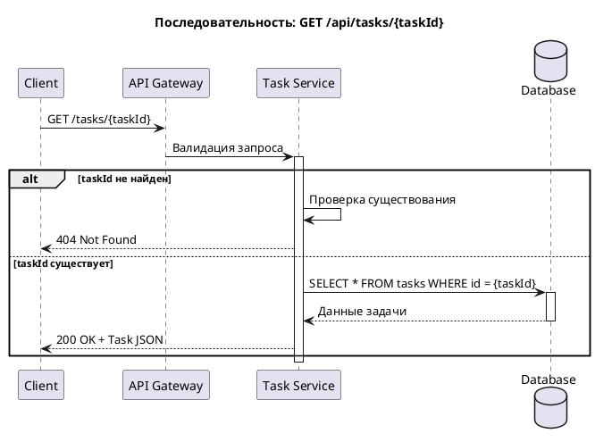

# GET `/api/tasks/{taskId}`

Возвращает информацию о задаче по её идентификатору. Позволяет получить текущий статус назначения супергероя на инцидент.

## HTTP метод и endpoint

```
GET /api/tasks/{taskId}
```

## Диаграмма последовательности



## Параметры запроса

### Path parameters

| Имя | Тип | Обязательный | Описание |
|-----|-----|--------------|----------|
| `taskId` | integer (int64) | Да | Идентификатор задачи |

## Пример запроса

```bash
curl -X GET "https://api.herotask.io/v1/tasks/99" \
  -H "Authorization: Bearer YOUR_API_KEY"
```

## Пример ответа

**Статус:** `200 OK`

```json
{
  "id": 99,
  "hero_id": 42,
  "incident_id": 7,
  "status": "active",
  "assigned_at": "2024-03-15T14:35:00Z",
  "completed_at": null,
  "notes": "Угроза нейтрализована, заложники освобождены"
}
```

## Структура ответа

| Поле | Тип | Описание |
|------|-----|----------|
| `id` | integer (int64) | Идентификатор задачи |
| `hero_id` | integer (int64) | Идентификатор назначенного супергероя |
| `incident_id` | integer (int64) | Идентификатор инцидента |
| `status` | string | Статус задачи: `active`, `completed`, `failed` |
| `assigned_at` | string (date-time) | Дата и время назначения задачи |
| `completed_at` | string (date-time), nullable | Дата завершения задачи (если выполнена) |
| `notes` | string | Комментарий по итогам задания |

## Коды ошибок

| Код | Описание |
|-----|----------|
| `200` | Задача найдена |
| `404` | Задача с указанным идентификатором не найдена |

### Пример ошибки 404

```json
{
  "code": "TASK_NOT_FOUND",
  "message": "Задача с идентификатором 999 не найдена"
}
```

## Статусы задач

:::note

Задача отражает назначение конкретного супергероя на инцидент. Один инцидент может иметь несколько задач (если назначено несколько героев).

:::

| Статус | Описание |
|--------|----------|
| `active` | Герой работает над заданием |
| `completed` | Задание успешно выполнено |
| `failed` | Задание не выполнено |

## Связанные методы

- [POST `/api/tasks`](./create-task.md) — Назначить задачу
- [PATCH `/api/tasks/{taskId}`](./update-task.md) — Обновить статус задачи
- [GET `/api/incidents/{incidentId}`](./get-incident.md) — Карточка инцидента
- [GET `/api/heroes/{heroId}`](./get-hero.md) — Карточка супергероя
