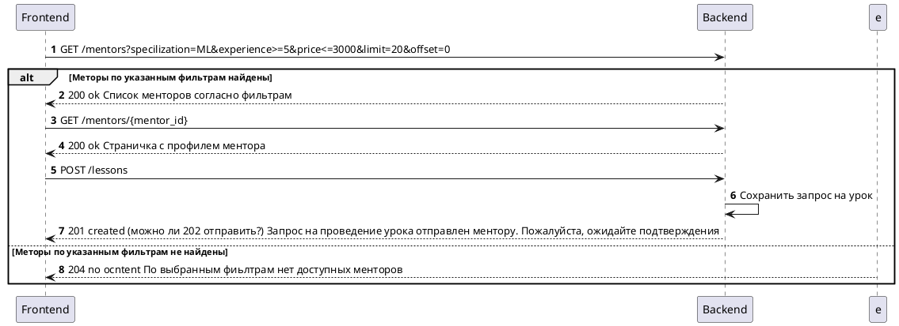

```plantuml
@startuml 
autonumber 
participant Frontend as fe 
participant Backend as be
fe->be: GET /mentors?specilization=ML&experience>=5&price<=3000&limit=20&offset=0
  alt Меторы по указанным фильтрам найдены
    be-->fe: 200 ok Список менторов согласно фильтрам
    fe->be: GET /mentors/{mentor_id}
    be-->fe: 200 ok Страничка с профилем ментора
    fe->be: POST /lessons
    be->be: Сохранить запрос на урок
    be-->fe: 201 created (можно ли 202 отправить?) Запрос на проведение урока отправлен ментору. Пожалуйста, ожидайте подтверждения
  else Меторы по указанным фильтрам не найдены
    e-->fe: 204 no ocntent По выбранным фиьлтрам нет доступных менторов
  end

@enduml 

```
## Описание алгоритма

1. Получить список менторов по фильтрам
2. Получить информацию о менторе
3. Создать урок