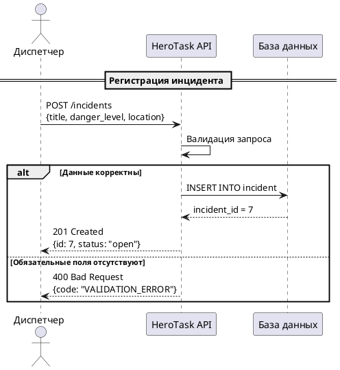

Диспетчер фиксирует угрозу в системе. После успешной регистрации инцидент переходит в статус `open` и становится доступен для назначения героя.

## Алгоритм

1. Диспетчер отправляет запрос `POST /incidents` с телом:
   - `title` — краткое описание угрозы (обязательно)
   - `danger_level` — уровень опасности 1–5 (обязательно)
   - `location` — адрес или координаты (опционально)

2. API валидирует запрос:
   - Если данные корректны — создаёт запись в базе, возвращает `201 Created` с присвоенным `id` и статусом `open`
   - Если отсутствуют обязательные поля — возвращает `400 Bad Request`

3. Инцидент со статусом `open` становится доступен для назначения в [сценарии 2](./scenario2).

:::tip
При `danger_level` 4 или 5 система автоматически отправляет уведомление дежурному старшему диспетчеру.
:::
