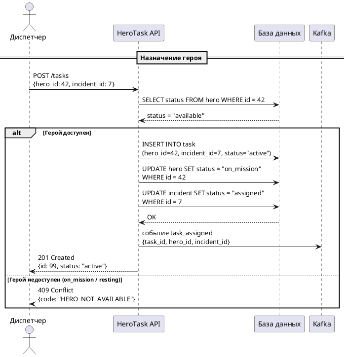

Диспетчер выбирает свободного супергероя и назначает его на открытый инцидент. Система проверяет доступность героя и создаёт задачу. Предварительное условие: инцидент зарегистрирован ([сценарий 1](./scenario1)) и имеет статус `open`.

## Алгоритм

1. Диспетчер отправляет запрос `POST /tasks` с телом:
   - `hero_id` — идентификатор выбранного героя (обязательно)
   - `incident_id` — идентификатор открытого инцидента (обязательно)

2. API проверяет статус героя в базе данных:
   - Если `available` — переходит к шагу 3
   - Если `on_mission` или `resting` — возвращает `409 Conflict`

3. При успешной проверке API атомарно:
   - Создаёт запись в таблице `TASK` со статусом `active`
   - Переводит героя в статус `on_mission`
   - Переводит инцидент в статус `assigned`

4. Отправляет событие `task_assigned` в Kafka для уведомления героя.

5. Возвращает диспетчеру `201 Created` с данными созданной задачи.

:::warning
Если между проверкой доступности и созданием задачи другой диспетчер успел назначить того же героя, второй запрос вернёт `409 Conflict`. Оптимистичная блокировка предотвращает двойное назначение.
:::
