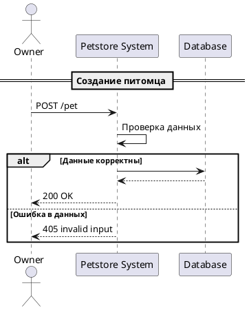

# qwerty

#### qwerty

```plantuml

@startuml

actor Owner
participant "Petstore System" as System
participant "Database" as DB

== Создание питомца ==
Owner -> System: POST /pet
System -> System: Проверка данных
alt Данные корректны
    System -> DB: 
    DB --> System: 
    System --> Owner: 200 OK
else Ошибка в данных
    System --> Owner: 405 invalid input
end

@enduml


```

1. **Owner** отправляет запрос: `POST /pet` с данными питомца.
2. **System** проверяет данные:
3. **System** сохраняет данные в **Database**.