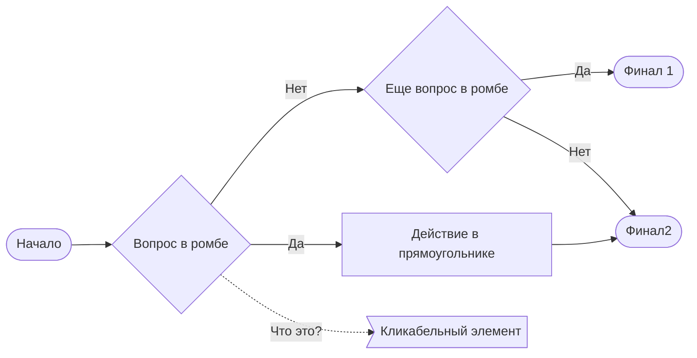

import Tabs from '@theme/Tabs';
import TabItem from '@theme/TabItem';

## Заголовки {#headers}

<details>

<summary>Как оформлять заголовки и подзаголовки</summary>

Каждая страница документации начинается с «шапки»:

```md
---
title: Оформление
sidebar_label: Оформление
slug: /for-engineers/engineer-policy/typography
sidebar_position: 2
---
```

Здесь:

* `title` — заголовок раздела.
* `sidebar_label` — то, как заголовок будет отображаться на левой навигационной панели. Параметр опционален, по умолчанию такой же как `title`.
* `slug` — определяет URL страницы документации. Должен быть уникален во всей документации. Не изменяй `slug` уже опубликованных разделов, даже если у раздела поменялось расположение или название. Так у пользователей и в каналах поддержки никогда не слетят ссылки на эту страницу.
* `sidebar_position` — положение раздела на левой навигационной панели, относительно родительского раздела.

Подзаголовки второго, третьего и четвертого уровней обозначай `##`, `###` и `####`, соответственно. После подзаголовка обязательно указывай якорь латиницей: `{#anchor}`. Якоря должны быть уникальны в рамках файла и в одном-двух словах отражать название. По якорю затем можно будет ссылаться на данный подраздел:

`## Подзаголовок второго уровня {#anchor2}`

`[Ссылка на подзаголовок второго уровня](#anchor2)`

</details>

## Шрифты {#fonts}

<details>

<summary>Как использовать выделение шрифтом</summary>

* Когда вводишь новый термин, выдели его _нижним подчеркиванием_:

    ```md
    _Инстанс_ — это основная сущность, которой управляет сервис.
    ```

* Элементы интерфейса выделяй **полужирным**:

    ```md
    Нажмите **Создать**.
    ```

* Значения переменных, полей UI, адресов, однострочных элементов кода и подобных параметров выделяй `бэктиками` (не путай их с обычными 'кавычками').

    ```md
    В поле **Порт** укажите `8080`.
    ```

* Примеры кода и команд выноси в блоки кода:

    ````md
    ```bash
    git add .
    git commit -m 'Commit description'
    ```
    ````

* Ссылки встраивай в текст в формате `[Текст](ссылка)`. Если текст содержит ссылку, никаким другим способом его выделять не нужно:

    ```md
    О том, как это сделать, читайте в [инструкции](example.com).
    ```

</details>

## Списки {#lists}

Используй списки для перечисления последовательных шагов или независимых тезисов.

Списки бывают двух видов: нумерованные и ненумерованные. Определи, какой тип списка нужно использовать в конкретной ситуации:

* Используй нумерованный список, когда по смыслу важен порядок перечисляемых элементов. Например, для оформления шагов в инструкции.
* Используй ненумерованный список, если порядок перечисляемых элементов не имеет значения. Например, при перечислении преимуществ или особенностей продукта/фичи.

Варианты написания элементов списка и пунктуации в конце могут различаться от списка к списку, но должны быть консистентны внутри одного списка, см. примеры ниже.

<details>

<summary>Ненумерованный список через запятую</summary>

```md
Вводная фраза с большой буквы и двоеточием в конце:

* элемент 1,
* элемент 2,
* элемент 3.
```

</details>

<details>

<summary>Ненумерованный список через точку с запятой</summary>

```md
Вводная фраза с большой буквы и двоеточием в конце:

* одно неполное предложение;
* другое неполное предложение;
* третье неполное предложение.
```

</details>

<details>

<summary>Ненумерованный список через точку</summary>

```md
Вводная фраза с большой буквы и двоеточием в конце:

* Полное предложение. Или несколько любых предложений.
* Второе предложение.
* Третье предложение.
```

</details>

<details>

<summary>Нумерованный список</summary>

```md
Чтобы сделать то-то:

1. Делайте раз.
1. Делайте два.
1. Делайте три.
```

* Если вводная фраза идет сразу за подзаголовком и дублирует его, вводную фразу нужно опустить.
* Элементы списка в исходнике Markdown нумеровать не нужно, достаточно поставить `1.`. Markdown пронумерует элементы автоматически в любом случае, а тебе не придется заботиться о правильной нумерации.

</details>

<details>

<summary>Вложенные списки</summary>

Следи за отступами и оставляй пустые строки до и после вложенного списка.

```md
Чтобы сделать то-то:

1. Делайте раз. Для этого:

    1. Сделайте то.
    1. Сделайте это.
    1. Сделайте пятое-десятое.

1. Делайте два. Тут есть особенности:

    * особенность 1;
    * особенность 2;
    * особенность 3.

1. Делайте три.
```

</details>

## Инфоплашки {#info}

Чтобы выделить в тексте важную информацию, используй инфоплашки. Название и цвет инфоплашки соответствует характеру информации, которая в ней подсвечивается, см. примеры.

<details>

<summary>Примечание</summary>

```md
:::info Примечание

Дополнительная информация о работе системы, которую нужно подсветить.

:::
```

:::info Примечание

Дополнительная информация о работе системы, которую нужно подсветить.

:::

</details>

<details>

<summary>Совет</summary>

```md
:::tip Совет

Совет по работе с системой, лучшие практики.

:::
```

:::tip Совет

Совет по работе с системой, лучшие практики.

:::

</details>

<details>

<summary>Важно</summary>

```md
:::caution Важно

Информация о работе системы, игнорирование которой может привести к простою, затруднениям или временной неработоспособности системы.

:::
```

:::caution Важно

Информация о работе системы, игнорирование которой может привести к простою, затруднениям или временной неработоспособности системы.

:::

</details>

<details>

<summary>Внимание</summary>

```md
:::danger Внимание

Информация о работе системы, игнорирование которой приведет к потере данных, нарушению информационной безопасности, длительному простою или выходу системы из строя.

:::
```

:::danger Внимание

Информация о работе системы, игнорирование которой приведет к потере данных, нарушению информационной безопасности, длительному простою или выходу системы из строя.

:::

</details>

## Раскрывающиеся элементы {#details}

Иногда техническую или опциональную информацию уместнее спрятать «под cut», чтобы она не заполоняла страницу и не мешала ориентироваться на странице. Так, почти всегда лучше спрятать в раскрывашку большие примеры блоков кода.

<details>

<summary>Название раскрывашки</summary>

```md
<details>

<summary>Название раскрывашки</summary>

Содержимое раскрывашки.

</details>
```

</details>

## Таблицы {#tables}

Функциональность таблиц в Markdown ограничена. Поэтому слишком сложные таблицы, например с объединением ячеек, сделать не получится. Подумай, как можно перекомпоновать информацию или используй HTML-теги для создания таблиц.

:::tip Совет

Одна строка таблицы = одна строка в Markdown. Чтобы таблицу было проще редактировать в исходнике, и было видно какой текст к какому столбцу относится, отключи сворачивание строк в твоем IDE.

Для VSCode: **View** → **Word Wrap**.

:::

<details>

<summary>Пример таблицы</summary>

```md
| Столбец 1 | Столбец 2 | Столбец 3 |
|:----------|:----------|:----------|
| Строка 1  | Строка 1  | Строка 1.1<br />Строка 1.2 |
| Строка 2  | Строка 2  | <ul><li>Строка 2.1</li><li>Строка 2.2</li></ul>|
```

| Столбец 1 | Столбец 2 | Столбец 3 |
|:----------|:----------|:----------|
| Строка 1  | Строка 1  | Строка 1.1<br />Строка 1.2 |
| Строка 2  | Строка 2  | <ul><li>Строка 2.1</li><li>Строка 2.2</li></ul>|

</details>

## Колонки {#columns}

Иногда, чтобы сделать подачу информации более компактной, хорошим решением может быть размещение текста в две колонки. При этом текст в каждой из колонок может быть любой сложности: включать списки, вкладки таблицы и даже подразделы.

<details>

<summary>Пример двух колонок</summary>

````md
<div style={{ width: '50%', float: 'left', clear: 'left' }}>

### Текст в левом столбце

* Один
* Два
* Три

</div>

<div style={{ width: '50%', float: 'right', clear: 'right' }}>

### Текст в правом столбце

| Один | Два  |
|:---- |:---- |
| 1    | 2    |

</div>

<div style={{ clear: 'both' }}>

</div>

Последняя пара тегов необходима, чтобы 
последующий за колонками текст не попадал в них при парсинге.
````

<div style={{ width: '50%', float: 'left', clear: 'left' }}>

### Текст в левом столбце

* Один
* Два
* Три

</div>

<div style={{ width: '50%', float: 'right', clear: 'right' }}>

### Текст в правом столбце

| Один | Два  |
|:---- |:---- |
| 1    | 2    |

</div>

<div style={{ clear: 'both' }}>

</div>

Последняя пара тегов необходима, чтобы последующий за колонками текст не попадал в них при парсинге.

</details>

## Вкладки {#tabs}

Вкладки особенно полезны в инструкциях, когда одно и то же действие можно выполнить по-разному: через разные интерфейсы или в разных ОС. Пользователь выберет релевантную для своей задачи вкладку и будет видеть только нужную информацию.

<details>

<summary>Пример вкладок</summary>

```md
import Tabs from '@theme/Tabs';
import TabItem from '@theme/TabItem';

<Tabs>
<TabItem value="first" label="Вкладка 1" default>

Содержимое первой вкладки.

</TabItem>
<TabItem value="second" label="Вкладка 2">

Содержимое второй вкладки.

</TabItem>
<TabItem value="third" label="Вкладка 3">

Содержимое третьей вкладки.

</TabItem>
</Tabs>
```

<Tabs>
<TabItem value="first" label="Вкладка 1" default>

Содержимое первой вкладки.

</TabItem>
<TabItem value="second" label="Вкладка 2">

Содержимое второй вкладки.

</TabItem>
<TabItem value="third" label="Вкладка 3">

Содержимое третьей вкладки.

</TabItem>
</Tabs>

</details>

## Рисунки {#figures}

Рисунки можно хранить как в выделенном каталоге в репозитории, например `docs/_assets/`, так и в каталоге `images` в каждом подразделе. Договорись с коллегами на проекте, как вам будет удобнее.

:::tip Совет

Не используй в документации скриншоты без необходимости. Их тяжело поддерживать актуальными, они занимают много места и, как правило, несут мало смысла. Пользователь и так видит этот интерфейс. Будет лучше, если ты текстом напишешь, куда в этом интерфейсе нажать, чтобы решить задачу.

Рисунки-схемы, которые описывают взаимодействие каких-то компонентов системы, наоборот, бывают очень наглядны и полезны. Но если речь о несложной схеме, лучше описать ее в формате [Mermaid-диаграммы](#mermaid).

:::

<details>

<summary>Как вставить рисунок</summary>

Вставь ссылку на рисунок в md-файл в отдельной строке в формате `[Название рисунка](относительный путь к файлу)`:

```md

```

</details>

<details>

<summary>Как вставить иконку в текст</summary>

Если тебе нужно вставить небольшую иконку прямо в текст, используй `import` и отрегулируй размер иконки с помощью параметра `width`:

```md
import PictureName from './images/shakal.jpg';

Очень маленькая иконка в тексте: .
```

</details>

## Mermaid-диаграммы {#mermaid}

Это инструмент, который позволяет хранить различные схемы, диаграммы, графики в виде текста.

<details>

<summary>Плюсы и минусы</summary>

Плюсы:

* Не занимает место в репозитории.
* Простой синтаксис, быстро освоить.
* Легко поддерживать актуальной. Если что-то изменится в реальности, то исправить пару строк текста проще, чем перерисовать рисунок.
* Поддерживается в Docusaurus из коробки, ничего не нужно дополнительно делать.

Минусы:

* Отрисовывает схему по-своему, не всегда так как хотелось бы с точки зрения размеров элементов.
* Большие схемы становятся не читабельными, иногда придется поразбираться с более сложными фичами синтаксиса, чтобы найти решение.

Подробнее на [официальном сайте](https://mermaid.js.org/intro/).

</details>

<details>

<summary>Пример</summary>

````md

````


В первой строчке `flowchart LR` обозначает тип диаграммы (блок-схема) и направление отрисовки — слева (L) направо (R).

В Mermaid поддерживается множество типов диаграмм, см. [документацию](https://mermaid.js.org/syntax/flowchart.html).

</details>

## Переиспользуемые фрагменты {#partials}

Если какой-то фрагмент текста, например примечание, используется в нескольких местах документации, помести его в отдельный файл, чтобы переиспользовать. Так дальнейшие возможные изменения этого фрагмента отразятся сразу на всех страницах документации, где он используется.

<details>

<summary>Как использовать</summary>

Чтобы переиспользовать фрагмент текста:

1. Создай в репозитории каталог `docs/_partials/` и при необходимости в нем создай подкаталог с именем твоего продукта, если в репозитории хранится документация нескольких продуктов.
1. Создай в этом подкаталоге md-файл и помести в него фрагмент текста, который планируешь переиспользовать в разных местах.
1. Импортируй переиспользуемый файл в тот файл, где он будет переиспользоваться. Вставь тег с меткой файла в строку, в которую будет вставлен текст:

    ```md
    import PartName from '../../_partials/<путь к файлу>';

    <PartName name="PartName"/>
    ```

    Здесь `PartName` — это метка переиспользуемого файла, должна быть уникальна в рамках основного файла.

Пример:

```md
import Example from './_partials/_reusable.md';

<Example name="Example"/>
```

</details>

Теперь, когда ты знаешь как лучше формулировать и оформлять текст документации, рассмотрим [как структурировать его](./structure.md).
